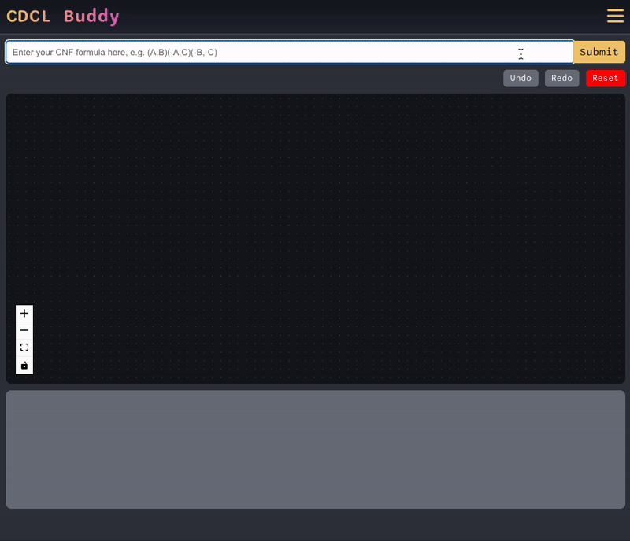

# CDCL Buddy

CDCL Buddy is an interactive educational tool designed to demystify Conflict-Driven Clause Learning (CDCL) SAT solvers. It provides a hands-on learning experience through dynamic visualizations, drag-and-drop interactivity, and real-time solver feedback. The app is aimed at students and educators seeking an intuitive way to explore SAT-solving techniques.  


## Features

- **Interactive Visualizations**: View and manipulate implication graphs dynamically.
- **Drag-and-Drop Interface**: Experiment with variable assignments to understand heuristics and their impact.
- **Custom CDCL Solver**: Features conflict detection, clause learning, and non-chronological backtracking implemented in JavaScript.
- **Tutorial Module**: Offers explanations of key concepts like conflict resolution, learned clauses, and decision heuristics.
- **Multi-Platform Access**: Available as a web app and mobile app on iOS and Android.

## Repository Directory

The repository is organized as follows:

### `src/components`

Contains the core React components:

- **Graph/**: Components for visualizing and interacting with the implication graph.

  - `CustomEdge.js`: Custom edges for the graph visualization.
  - `CustomNode.js`: Custom nodes for the graph visualization.
  - `Graph.js`: Main graph rendering component.

- **Modals/**: Components for displaying modal dialogs related to SAT solving.

  - `ConflictModal.js`: Displays information about conflicts and learned clauses.
  - `SatModal.js`: Shown when a satisfiable solution is found.
  - `UnsatModal.js`: Shown when the SAT problem is unsatisfiable.
  - `TutorialModal.js`: Interactive tutorial to guide users through CDCL concepts.

- **UI/**: General UI components.
  - `Clause.js`: Handles clause representation and interactions.
  - `VariableBox.js`: Displays variables and their assignments.

### `src/images`

Contains static assets used in the application, such as demo animations and graph images:

- `demo.gif`: An animated demonstration of the app’s functionality.
- `graph1.png` to `graph5.png`: Sample graph images for tutorials or debugging.

### `src/utils`

Includes utility functions and custom hooks:

- `CustomHooks.js`: Contains reusable hooks for managing application state and interactivity.

### Root Files

- **`App.js`**: The main React app entry point.
- **`App.css`**: Global styles for the application.
- **`index.js`**: Entry point for rendering the React app.
- **`index.css`**: Base styles for the app.
- **`setupTests.js`**: Configures testing utilities.
- **`reportWebVitals.js`**: Performance monitoring.

### Other Files

- **`.gitignore`**: Specifies files and directories to ignore in version control.
- **`package.json` & `package-lock.json`**: Manage project dependencies and scripts.
- **`LICENSE`**: Contains the MIT License for the project.
- **`README.md`**: This documentation file.

## Installation

### Local Setup

1. Clone the repository:
   ```bash
   git clone https://github.com/toluooshy/cdcl-buddy.git
   cd cdcl-buddy
   ```
2. Install dependencies:
   ```bash
   npm install
   ```
3. Start the development server:
   ```bash
   npm start
   ```

### Mobile App

- Download from:
  - [Apple App Store](https://apps.apple.com/us/app/cdcl-buddy/id6738808478)
  - [Google Play Store](https://play.google.com/store/apps/details?id=com.cdclbuddy.cdclbuddy)

## Usage

### Input Format

Enter a SAT problem in **CNF format** (e.g., `(A, B)(-A, C)(-B, -C)`) in the input box. Use the interactive graph to explore variable assignments and observe real-time solver updates.

### Key Components

- **Graph Visualization**: Nodes represent variables or decisions, while edges illustrate implications and conflicts.
- **Conflict Modal**: Highlights conflicts and provides options to add learned clauses using heuristics like First UIP or negation.
- **Tutorial Module**: Explains CDCL processes in a step-by-step manner for self-guided learning.

## Development Overview

### Frameworks and Libraries

- **React**: Front-end framework for interactive UI.
- **React Flow**: Dynamic graph rendering and manipulation.
- **React Native**: Cross-platform mobile app support. For the React Native-specific repository, see [here](https://github.com/toluooshy/cdcl-buddy-app).

### Core Logic

The CDCL solver handles:

- **Conflict Detection**: Identifies and resolves conflicts in the clause set.
- **Clause Learning**: Adds learned clauses based on heuristics (e.g., First UIP).
- **Backtracking**: Implements non-chronological backtracking to improve efficiency.

## Contributing

We welcome contributions! To contribute:

1. Fork the repository.
2. Create a new branch:
   ```bash
   git checkout -b feature-name
   ```
3. Commit changes and push:
   ```bash
   git commit -m "Add feature name"
   git push origin feature-name
   ```
4. Open a pull request.

## License

This project is licensed under the [MIT License](LICENSE).
